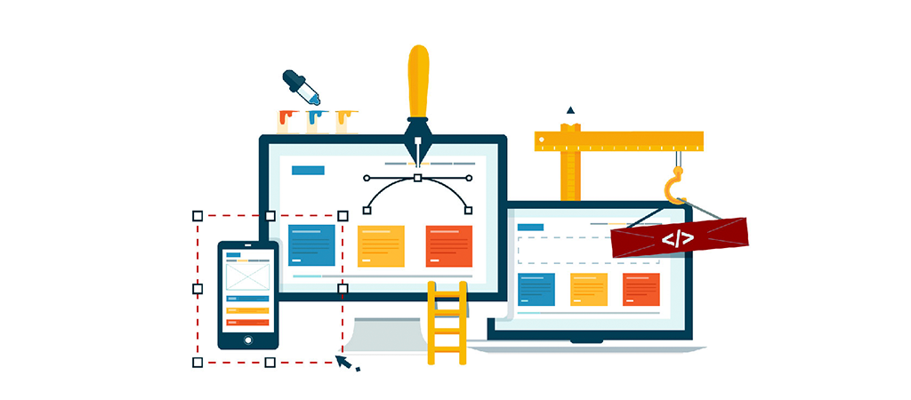

# Curso: Maquetador web Avanzado  |  código 62518

> Curso Maquetador web Avanzado |   
> Martes y Jueves 20hs a 22hs (Arg) |  
> 15 clases desde 23/02 hasta 18/04
> Código: 62518 |  
> sensei: Marcos Pinardi |

--- 

### Aprende a crear interfaces web con los dos lenguajes que constituyen la esencia de la red.  Domina herramientas avanzadas de maquetado, incorpora efectos, animaciones y estilos para realizar webs impactantes.

 
 